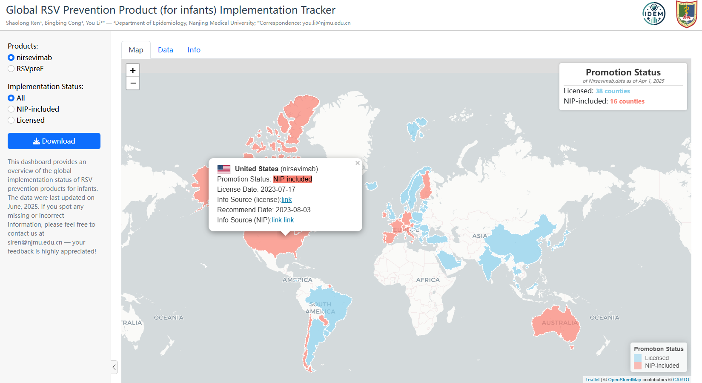

This repository contains the analysis and modelling code for the manuscript:
**“Regional inequality in infant RSV morbidity and mortality burden in the era of expanded RSV passive immunisation: a global projection modelling study.”**

The project quantifies RSV-associated morbidity and mortality burden in infants and its regional (WHO region) and economic (World Bank income group) inequality, comparing **2019** estimates with **2026** projections under:

- a **no-implementation** counterfactual scenario, and
- a **status quo / June-2025 product use** scenario for expanded RSV passive immunisation.

### Project structure (high level)

- **Root `code_*.R` scripts**: main analysis pipeline, broadly numbered in execution order (01→12).
- `**functions.R`**: shared utilities (tables, plotting helpers, themes) sourced by most scripts.
- `**data/`**: raw inputs (population, seasonality, product tracking, external datasets).
- `**rda/**`: cached intermediate objects (`.rds`, `.RData`) produced by upstream scripts.
- `**model_data/**`: model inputs/outputs used by the projection model.
- `**plot/`, `Figures/`, `pdf/`, `docs/**`: exported figures and tables for reporting.

### Typical execution flow

Run from the project root so relative paths resolve correctly.

- **Burden estimation (2019 inputs)**: `code_01_*.R` → `code_05_*.R`
- **Documentation/plots**: `code_06_*.R` → `code_07_*.R`
- **Population + product tracking**: `code_08_*.R` → `code_10.*.R`
- **Model + results**: `code_11.1_*.R` → `code_11.8_*.R`
- **Sensitivity analyses**: `code_12_*.R`

Below are the input/output notes and per-script descriptions.

## 1.Data input

### 🗃️ workspaceToBegin.RData

Initial data objects and functions for the 2019 burden estimation workflow (carried forward from the previous study).

### 🗃️ data/mor_all_DeCoDe.predict.rds

National mortality rate data(1000 samples for each country).

### 📁 data/

Raw data on population, seasonality, and immunisation tracking.

---

## 2.Main Analysis Scripts

### 📄 code_01_incidence.R

Estimate RSV-associated ALRI community incidence rates in infants by WHO region and income level (with imputation and meta-analysis).

### 📄 code_02_hospitalisation.R

Estimate RSV-associated ALRI hospital admission rates in infants by WHO region and income level (with imputation and meta-analysis).

### 📄 code_03_Inc_to_Hos_ratio.R

Analyzes the ratio of community incidence to hospitalization for RSV-ALRI.

### 📄 code_03_inc_to_hos_ratio.R

Lowercase-named variant of the incidence-to-hospitalisation ratio script (kept for compatibility). Prefer `code_03_Inc_to_Hos_ratio.R` unless you specifically rely on this filename.

### 📄 code_04_in_hos_CFR.R

Estimate the in-hospital case fatality ratio (CFR) for infants hospitalized with RSV-ALRI.

### 📄 code_05_overall_mortality.R

Estimate the overall mortality burden of RSV-ALRI in infants.

### 📄 code_06_study_inclusion.R

Document and visualize the inclusion of studies in the meta-analyses for incidence, hospitalization, and mortality.

### 📄 code_07_plot_for_incidence.R

Generates comprehensive visualizations of the RSV burden, including incidence, hospitalization, mortality, and ratios, for main figures and supplementary materials.

### 📄 code_08_population_by_country.R

Prepares and harmonizes country-level population data for infants.

### 📄 code_09_nirsevimab_tracker.R

Tracks the global rollout and status of RSV preventive interventions (Nirsevimab and Abrysvo) by country.

### 📄 code_map.R

Create world maps showing implementation status categories (licensed vs NIP-included vs unlicensed) for nirsevimab and RSVpreF (Abrysvo).

### 📄 code_uptake.R

Extract and clean WHO vaccine coverage data (e.g., Tdap proxies) used to inform maternal RSVpreF uptake assumptions.

### 📄 code_10.1_country_center_and_category.R

Categorise countries by geography (centroids/latitude bands), hemisphere, and climate zone for stratified analyses.

### 📄 code_10.2_seasonality_data.R

Collect and standardise RSV seasonality inputs for selected countries (country-by-country extraction from public sources).

### 📄 code_11.1_previous_mortality_mc_data.R

Prepare previous Monte Carlo mortality data for model input

### 📄 code_11.2_model.R

Implements the main mathematical model for projecting RSV burden and intervention impact from 2019 to 2026.

### 📄 code_11.3_model_result.R

Summarizes and visualizes the results of the main model simulations. - Aggregates model outputs by region and income group. - Calculates changes in hospitalizations and deaths between 2019 and 2026, with and without interventions. - Prepares tables and figures for publication, including main results and appendix tables.

### 📄 code_11.4_Figure5_by_region.R

Generates Figure 5 and related visualizations, showing projected changes in RSV burden by WHO region. - Aggregates and visualizes model results for each region. - Calculates and displays percentage changes in hospitalizations and deaths. - Supports main text and supplementary figure generation.

### 📄 code_11.5_Figure5_by_income.R

Generates Figure 5 and related visualizations, showing projected changes in RSV burden by World Bank income group. - Aggregates and visualizes model results for each income group. - Calculates and displays percentage changes in hospitalizations and deaths. - Supports main text and supplementary figure generation.

### 📄 code_11.6_Gini.R

Analyzes and visualizes inequality in RSV burden using Gini coefficients. - Calculates Gini indices for hospitalizations and mortality at global, regional, and income-group levels. - Produces Lorenz curves and summary statistics to quantify disparities in RSV burden. - Supports the manuscript’s focus on health equity and burden distribution.

### 📄 code_11.7_Table2_Figure_sens.R

Generate Table 2 and sensitivity-analysis figures across uptake/effectiveness scenarios and strata (region/income/global).

### 📄 code_11.8_Quintile.R

Quantify inequality using Q5/Q1 (population-weighted quintiles) for projected burden metrics.

### 📄 code_12_sensitive_analysis_use_GBD_data.R

Sensitivity analysis using GBD 2023 RSV mortality inputs.

### 📄 functions.R

Utility functions.

### 📄 mainScript.R

Initial code for disease burden estimate in 2019.

### 📁 Age_distribution_infants/

Estimate the age distribution of RSV hospital admissions by WHO region and income level.

### 📁 shiny/

Shiny app source for the immunisation tracker.

This dashboard summarises the global implementation status of RSV prevention products for infants, using data curated up to **June 2025**. It is publicly available at: [idem.njmu.edu.cn/shiny/rsvpassiveimmutracker](https://idem.njmu.edu.cn/shiny/rsvpassiveimmutracker/).



---

## 3. Output

### 📁 WHO region/

Exported data generated from `mainScript.R`.

---

### 📁 model_data/

Data imported and exported in the model section.

### 📁 rda/

Contains exported `.rds` and `.RData` files.

### 📁 docs/

Contains exported `.docx` and `.xlsx` documents.

### 📁 pdf/

Contains exported `.pdf` figures.

### 📁 Figures/

Contains exported figures in image format (e.g., `.png`, `.tiff`, etc.).

### 📁 plot/

Contains exported figures in image format (e.g., `.png`, `.tiff`, etc.).

## 4. Session Info

```
> sessioninfo::session_info()
─ Session info ─────────────────────────────────────────────────────────────────────────────────────────
 setting  value
 version  R version 4.3.3 (2024-02-29 ucrt)
 os       Windows 11 x64 (build 26200)
 system   x86_64, mingw32
 ui       RStudio
 language (EN)
 collate  Chinese (Simplified)_China.utf8
 ctype    Chinese (Simplified)_China.utf8
 tz       Etc/GMT-8
 date     2026-03-18
 rstudio  2024.09.1+394 Cranberry Hibiscus (desktop)
 pandoc   3.2 @ D:/Program Files/RStudio/resources/app/bin/quarto/bin/tools/ (via rmarkdown)

─ Packages ─────────────────────────────────────────────────────────────────────────────────────────────
 package           * version    date (UTC) lib source
 Amelia            * 1.8.3      2024-11-08 [1] CRAN (R 4.3.3)
 askpass             1.2.1      2024-10-04 [1] CRAN (R 4.3.3)
 BiasedUrn           2.0.12     2024-06-16 [1] CRAN (R 4.3.3)
 cellranger          1.1.0      2016-07-27 [1] CRAN (R 4.3.3)
 class               7.3-23     2025-01-01 [1] CRAN (R 4.3.3)
 classInt            0.4-11     2025-01-08 [1] CRAN (R 4.3.3)
 cli                 3.6.3      2024-06-21 [1] CRAN (R 4.3.3)
 coda              * 0.19-4.1   2024-01-31 [1] CRAN (R 4.3.3)
 codetools           0.2-20     2024-03-31 [1] CRAN (R 4.3.3)
 colorspace        * 2.1-1      2024-07-26 [1] CRAN (R 4.3.3)
 cowplot           * 1.1.3      2024-01-22 [1] CRAN (R 4.3.3)
 curl                6.2.1      2025-02-19 [1] CRAN (R 4.3.3)
 data.table          1.16.2     2024-10-10 [1] CRAN (R 4.3.3)
 datawizard          1.0.0      2025-01-10 [1] CRAN (R 4.3.3)
 DBI                 1.2.3      2024-06-02 [1] CRAN (R 4.3.3)
 digest              0.6.37     2024-08-19 [1] CRAN (R 4.3.3)
 dplyr             * 1.1.4      2023-11-17 [1] CRAN (R 4.3.3)
 e1071               1.7-16     2024-09-16 [1] CRAN (R 4.3.3)
 echarts4r         * 0.4.5      2023-06-16 [1] CRAN (R 4.3.3)
 epiR              * 2.0.78     2024-12-10 [1] CRAN (R 4.3.3)
 evaluate            1.0.3      2025-01-10 [1] CRAN (R 4.3.3)
 farver              2.1.2      2024-05-13 [1] CRAN (R 4.3.3)
 fastmap             1.2.0      2024-05-15 [1] CRAN (R 4.3.3)
 flextable         * 0.9.7      2024-10-27 [1] CRAN (R 4.3.3)
 fontBitstreamVera   0.1.1      2017-02-01 [1] CRAN (R 4.3.1)
 fontLiberation      0.1.0      2016-10-15 [1] CRAN (R 4.3.1)
 fontquiver          0.2.1      2017-02-01 [1] CRAN (R 4.3.3)
 forcats           * 1.0.0      2023-01-29 [1] CRAN (R 4.3.3)
 foreign             0.8-86     2023-11-28 [1] CRAN (R 4.3.3)
 fs                  1.6.5      2024-10-30 [1] CRAN (R 4.3.3)
 furrr             * 0.3.1      2022-08-15 [1] CRAN (R 4.3.3)
 future            * 1.34.0     2024-07-29 [1] CRAN (R 4.3.3)
 gdtools             0.4.1      2024-11-04 [1] CRAN (R 4.3.3)
 generics            0.1.3      2022-07-05 [1] CRAN (R 4.3.3)
 ggeffects           2.0.0      2024-11-27 [1] CRAN (R 4.3.3)
 ggforce           * 0.4.2      2024-02-19 [1] CRAN (R 4.3.3)
 ggplot2           * 3.5.1      2024-04-23 [1] CRAN (R 4.3.3)
 ggplotify         * 0.1.2      2023-08-09 [1] CRAN (R 4.3.3)
 ggsci             * 3.2.0      2024-06-18 [1] CRAN (R 4.3.3)
 ggtext            * 0.1.2      2022-09-16 [1] CRAN (R 4.3.3)
 globals             0.16.3     2024-03-08 [1] CRAN (R 4.3.3)
 glue                1.8.0      2024-09-30 [1] CRAN (R 4.3.3)
 gridGraphics        0.5-1      2020-12-13 [1] CRAN (R 4.3.3)
 gridtext            0.1.5      2022-09-16 [1] CRAN (R 4.3.3)
 gtable              0.3.6      2024-10-25 [1] CRAN (R 4.3.3)
 hms                 1.1.3      2023-03-21 [1] CRAN (R 4.3.3)
 htmltools           0.5.8.1    2024-04-04 [1] CRAN (R 4.3.3)
 htmlwidgets         1.6.4      2023-12-06 [1] CRAN (R 4.3.3)
 httpuv              1.6.15     2024-03-26 [1] CRAN (R 4.3.3)
 ineq              * 0.2-13     2014-07-21 [1] CRAN (R 4.3.1)
 insight             1.0.1      2025-01-10 [1] CRAN (R 4.3.3)
 janitor           * 2.2.1      2024-12-22 [1] CRAN (R 4.3.3)
 jsonlite            1.8.9      2024-09-20 [1] CRAN (R 4.3.3)
 KernSmooth          2.23-26    2025-01-01 [1] CRAN (R 4.3.3)
 knitr               1.49       2024-11-08 [1] CRAN (R 4.3.3)
 later               1.4.1      2024-11-27 [1] CRAN (R 4.3.3)
 lattice             0.22-5     2023-10-24 [1] CRAN (R 4.3.3)
 lifecycle           1.0.4      2023-11-07 [1] CRAN (R 4.3.3)
 listenv             0.9.1      2024-01-29 [1] CRAN (R 4.3.3)
 lubridate         * 1.9.3      2023-09-27 [1] CRAN (R 4.3.3)
 magrittr            2.0.3      2022-03-30 [1] CRAN (R 4.3.3)
 mapdata           * 2.3.1      2022-11-01 [1] CRAN (R 4.3.3)
 maps              * 3.4.2.1    2024-11-10 [1] CRAN (R 4.3.3)
 maptools          * 1.1-8      2023-07-18 [1] CRAN (R 4.3.3)
 MASS              * 7.3-60.0.1 2024-01-13 [1] CRAN (R 4.3.3)
 mathjaxr            1.6-0      2022-02-28 [1] CRAN (R 4.3.3)
 Matrix            * 1.6-5      2024-01-11 [1] CRAN (R 4.3.3)
 MatrixModels        0.5-3      2023-11-06 [1] CRAN (R 4.3.3)
 mcmc                0.9-8      2023-11-16 [1] CRAN (R 4.3.3)
 MCMCpack          * 1.7-1      2024-08-27 [1] CRAN (R 4.3.3)
 metadat           * 1.2-0      2022-04-06 [1] CRAN (R 4.3.3)
 metafor           * 4.6-0      2024-03-28 [1] CRAN (R 4.3.3)
 mime                0.12       2021-09-28 [1] CRAN (R 4.3.1)
 munsell             0.5.1      2024-04-01 [1] CRAN (R 4.3.3)
 nlme                3.1-164    2023-11-27 [1] CRAN (R 4.3.3)
 numDeriv          * 2016.8-1.1 2019-06-06 [1] CRAN (R 4.3.1)
 officer           * 0.6.7      2024-10-09 [1] CRAN (R 4.3.3)
 openssl             2.2.2      2024-09-20 [1] CRAN (R 4.3.3)
 openxlsx          * 4.2.7.1    2024-09-20 [1] CRAN (R 4.3.3)
 pander              0.6.5      2022-03-18 [1] CRAN (R 4.3.3)
 parallelly          1.41.0     2024-12-18 [1] CRAN (R 4.3.3)
 patchwork         * 1.3.0      2024-09-16 [1] CRAN (R 4.3.3)
 performance         0.12.4     2024-10-18 [1] CRAN (R 4.3.3)
 pillar              1.10.1     2025-01-07 [1] CRAN (R 4.3.3)
 pkgconfig           2.0.3      2019-09-22 [1] CRAN (R 4.3.3)
 plyr              * 1.8.9      2023-10-02 [1] CRAN (R 4.3.3)
 polyclip            1.10-7     2024-07-23 [1] CRAN (R 4.3.3)
 promises            1.3.2      2024-11-28 [1] CRAN (R 4.3.3)
 proxy               0.4-27     2022-06-09 [1] CRAN (R 4.3.3)
 purrr             * 1.0.2      2023-08-10 [1] CRAN (R 4.3.3)
 quantreg            5.99.1     2024-11-22 [1] CRAN (R 4.3.3)
 R.methodsS3         1.8.2      2022-06-13 [1] CRAN (R 4.3.3)
 R.oo                1.27.0     2024-11-01 [1] CRAN (R 4.3.3)
 R.utils             2.12.3     2023-11-18 [1] CRAN (R 4.3.3)
 R6                  2.5.1      2021-08-19 [1] CRAN (R 4.3.3)
 ragg                1.3.3      2024-09-11 [1] CRAN (R 4.3.3)
 Rcpp              * 1.0.13-1   2024-11-02 [1] CRAN (R 4.3.3)
 readr             * 2.1.5      2024-01-10 [1] CRAN (R 4.3.3)
 readxl            * 1.4.3      2023-07-06 [1] CRAN (R 4.3.3)
 rgdal             * 1.6-7      2023-05-31 [1] CRAN (R 4.3.3)
 rio               * 1.2.3      2024-09-25 [1] CRAN (R 4.3.3)
 rlang               1.1.4      2024-06-04 [1] CRAN (R 4.3.3)
 rmarkdown           2.29       2024-11-04 [1] CRAN (R 4.3.3)
 rstudioapi          0.17.1     2024-10-22 [1] CRAN (R 4.3.3)
 scales            * 1.3.0      2023-11-28 [1] CRAN (R 4.3.3)
 sessioninfo         1.2.2      2021-12-06 [1] CRAN (R 4.3.3)
 sf                  1.0-19     2024-12-04 [1] Github (r-spatial/sf@39e8f51)
 shiny               1.10.0     2024-12-14 [1] CRAN (R 4.3.3)
 showtext          * 0.9-7      2024-03-02 [1] CRAN (R 4.3.3)
 showtextdb        * 3.0        2020-06-04 [1] CRAN (R 4.3.3)
 sjlabelled          1.2.0      2022-04-10 [1] CRAN (R 4.3.3)
 sjmisc              2.8.10     2024-05-13 [1] CRAN (R 4.3.3)
 sjPlot            * 2.8.17     2024-11-29 [1] CRAN (R 4.3.3)
 sjstats             0.19.0     2024-05-14 [1] CRAN (R 4.3.3)
 snakecase           0.11.1     2023-08-27 [1] CRAN (R 4.3.3)
 sp                * 2.1-4      2024-04-30 [1] CRAN (R 4.3.3)
 SparseM             1.84-2     2024-07-17 [1] CRAN (R 4.3.3)
 stringi             1.8.4      2024-05-06 [1] CRAN (R 4.3.3)
 stringr           * 1.5.1      2023-11-14 [1] CRAN (R 4.3.3)
 survival          * 3.5-8      2024-02-14 [1] CRAN (R 4.3.3)
 sysfonts          * 0.8.9      2024-03-02 [1] CRAN (R 4.3.3)
 systemfonts         1.1.0      2024-05-15 [1] CRAN (R 4.3.3)
 textshaping         0.4.0      2024-05-24 [1] CRAN (R 4.3.3)
 tibble            * 3.2.1      2023-03-20 [1] CRAN (R 4.3.3)
 tidyr             * 1.3.1      2024-01-24 [1] CRAN (R 4.3.3)
 tidyselect          1.2.1      2024-03-11 [1] CRAN (R 4.3.3)
 tidyverse         * 2.0.0      2023-02-22 [1] CRAN (R 4.3.3)
 timechange          0.3.0      2024-01-18 [1] CRAN (R 4.3.3)
 tweenr              2.0.3      2024-02-26 [1] CRAN (R 4.3.3)
 tzdb                0.4.0      2023-05-12 [1] CRAN (R 4.3.3)
 units               0.8-5      2023-11-28 [1] CRAN (R 4.3.3)
 uuid                1.2-1      2024-07-29 [1] CRAN (R 4.3.3)
 vctrs               0.6.5      2023-12-01 [1] CRAN (R 4.3.3)
 withr               3.0.2      2024-10-28 [1] CRAN (R 4.3.3)
 xfun                0.49       2024-10-31 [1] CRAN (R 4.3.3)
 xml2                1.3.6      2023-12-04 [1] CRAN (R 4.3.3)
 xtable              1.8-4      2019-04-21 [1] CRAN (R 4.3.3)
 yulab.utils         0.1.9      2025-01-07 [1] CRAN (R 4.3.3)
 zip                 2.3.1      2024-01-27 [1] CRAN (R 4.3.3)
 zoo                 1.8-12     2023-04-13 [1] CRAN (R 4.3.3)

 [1] D:/Program Files/R/R-4.3.3/library
```

