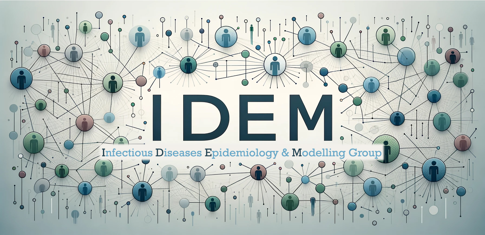

## Introduction

This dashboard provides a global overview of the adoption of RSV prevention products for infants.  **Last updated:** April 1, 2025.

## Searching Method
Information on the licensing and implementation status of the long-acting monoclonal antibody **Nirsevimab** and the maternal RSV vaccine **RSVpreF** across countries was collected through systematic web searches using keywords such as *“Nirsevimab”*, *“Beyfortus”*, *“RSVpreF”*, *“antibody”*, *“maternal vaccine”*, *“RSV”*, *“licensed”*, *“approved”*, and *“approval”*, as well as local-language equivalents, each combined with country names.

Search results were cross-validated using official national regulatory and health authority websites, as well as published literature.

## Terminology

- **Licensed**: Approved but **not** yet included in national immunisation programmes (NIPs).  
- **NIP-included**: Approved **and** included in NIPs.  
- **Income level**: Based on [World Bank income classification (2019)](https://ourworldindata.org/grapher/world-bank-income-groups).  
- **WHO region**: As defined by [WHO official regional groupings](https://apps.who.int/violence-info/Countries%20and%20areas%20by%20WHO%20region%20-%2012bfe12.pdf)

---

Despite our efforts, omissions may exist.If you spot any missing or incorrect information, please feel free to contact us([Infectious Diseases Epi & Model Group](https://leoly2017.github.io/group/index.html)) at [slren@njmu.edu.cn](mailto:slren@njmu.edu.cn) — your feedback is highly appreciated!

